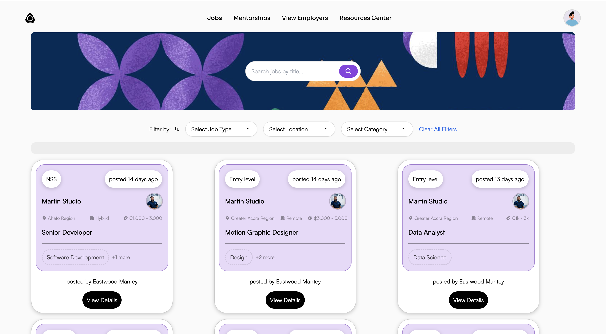

# 📝 entrynest


> **entrynest** is a modern, user-friendly platform for managing and organizing your entries, notes, or journal logs with ease.

---

## 📚 Table of Contents

- [Features](#-features)
- [Screenshots](#-screenshots)
- [Getting Started](#-getting-started)
- [Usage](#-usage)
- [Technologies Used](#-technologies-used)
- [Project Structure](#-project-structure)
- [Contributing](#-contributing)
- [FAQ](#-faq)
- [License](#-license)
- [Author](#-author)
- [Contact](#contact)

---

## 🚀 Features

- ✨ **Beautiful UI:** Clean, responsive, and intuitive interface.
- 🗂️ **Organize Entries:** Create, edit, and categorize your notes or journal entries.
- 🔍 **Search & Filter:** Quickly find entries with powerful search and filter options.
- ☁️ **Cloud Sync:** (Optional) Sync your entries across devices.
- 🔒 **Privacy First:** Your data stays with you.
- 🌓 **Dark Mode:** Switch between light and dark themes.

---

## 📸 Screenshots

<!-- Add your screenshots here -->
<p align="center">
  
  <br/>
  
</p>

---

## 🛠️ Getting Started

### Prerequisites

- [Node.js](https://nodejs.org/) (v14 or higher)
- [npm](https://www.npmjs.com/) or [yarn](https://yarnpkg.com/)

### Installation

```bash
git clone https://github.com/yourusername/entrynest.git
cd entrynest
npm install
# or
yarn install
```

### Running Locally

```bash
npm start
# or
yarn start
```

Visit [http://localhost:3000](http://localhost:3000) to view the app.

---

## 💡 Usage

1. **Sign Up / Log In:** Create an account or log in to access your entries.
2. **Create Entries:** Click the "New Entry" button to add notes or journal logs.
3. **Organize:** Use categories and tags to organize your entries.
4. **Search & Filter:** Use the search bar or filters to quickly find entries.
5. **Edit/Delete:** Click on any entry to edit or delete it.
6. **Switch Theme:** Toggle between light and dark mode from the settings.

---

## 🛠️ Technologies Used

- [React](https://reactjs.org/)
- [TypeScript](https://www.typescriptlang.org/) (if applicable)
- [Redux](https://redux.js.org/) (if used)
- [Styled Components](https://styled-components.com/) / [Tailwind CSS](https://tailwindcss.com/) (if used)
- [React Router](https://reactrouter.com/)
- [Axios](https://axios-http.com/) (for API calls)
- [Jest](https://jestjs.io/) / [React Testing Library](https://testing-library.com/) (for testing)

---

## 📦 Project Structure

```
entrynest/
├── public/
├── src/
│   ├── components/
│   ├── pages/
│   ├── hooks/
│   └── ...
├── package.json
└── README.md
```

---

## 🤝 Contributing

Contributions, issues and feature requests are welcome!  
Feel free to check [issues page](https://github.com/yourusername/entrynest/issues) or submit a pull request.

---

## ❓ FAQ

**Q: Is my data private?**  
A: Yes, your data is stored securely and never shared.

**Q: Can I use entrynest on mobile?**  
A: Yes, entrynest is fully responsive and works on all devices.

**Q: How do I report a bug?**  
A: Please open an issue on the [GitHub Issues page](https://github.com/yourusername/entrynest/issues).

---

## 📄 License

This project is licensed under the MIT License.

---

## 🙋‍♂️ Author

- **Your Name** – [@yourgithub](https://github.com/yourusername)

---

## 📬 Contact

For questions or support, please email [your.email@example.com](mailto:your.email@example.com).

---

> Made with ❤️ for productivity and peace of mind.
