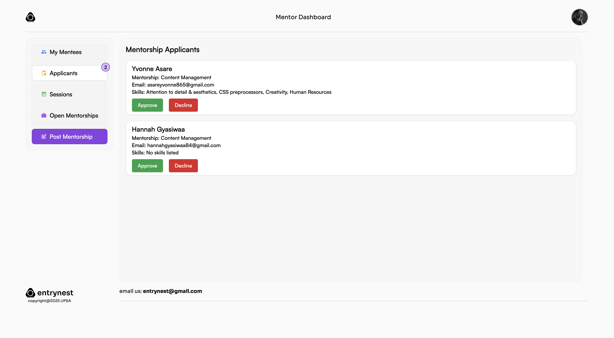
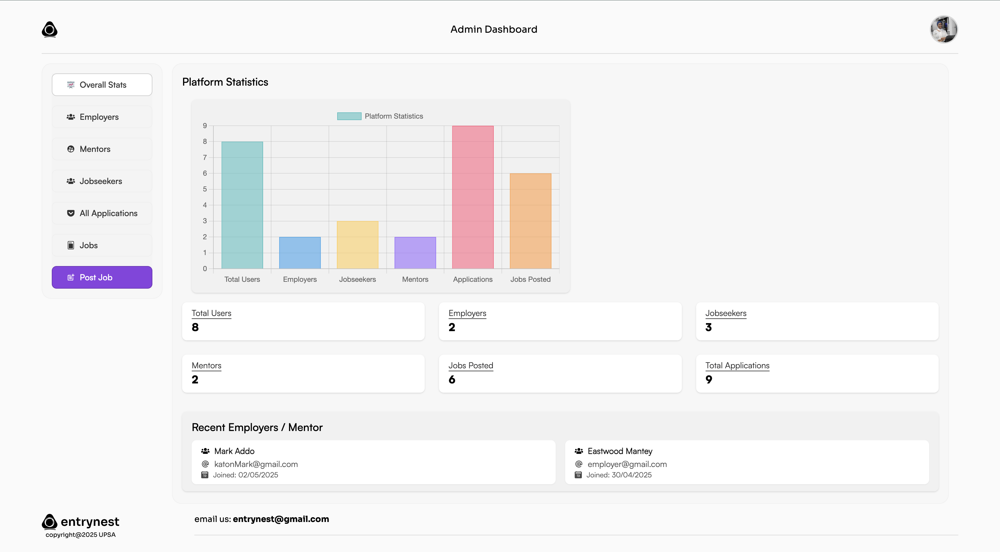

# 📝 entrynest


> **entrynest** is a modern, user-friendly platform for managing and organizing your entries, notes, or journal logs with ease.

---

## 📚 Table of Contents

- [Features](#-features)
- [Screenshots](#-screenshots)
- [Getting Started](#-getting-started)
- [Usage](#-usage)
- [Technologies Used](#-technologies-used)
- [Project Structure](#-project-structure)
- [Deployment](#-deployment)
- [Contributing](#-contributing)
- [FAQ](#-faq)
- [License](#-license)
- [Author](#-author)
- [Contact](#contact)

---

## 🚀 Features

- ✨ **Beautiful UI:** Clean, responsive, and intuitive interface.
- 🗂️ **Organize Entries:** Create, edit, and categorize your notes or journal entries.
- 🔍 **Search & Filter:** Quickly find entries with powerful search and filter options.
- ☁️ **Cloud Sync:** (Optional) Sync your entries across devices.
- 🔒 **Privacy First:** Your data stays with you.

---

## 📸 Screenshots

<!-- Add your screenshots here -->
<p align="center">
  
</p>
<p align="center">
  
</p>
<p align="center">
  
</p>
<p align="center">
  
</p>
<p align="center">
  
</p>
<p align="center">
  
</p>

---

## 🛠️ Getting Started

### Prerequisites

- [Node.js](https://nodejs.org/) (v14 or higher)
- [npm](https://www.npmjs.com/) or [yarn](https://yarnpkg.com/)
- [MongoDB](https://www.mongodb.com/) (Atlas or local)

### Installation

#### 1. Clone the repository

```bash
git clone https://github.com/nyator/entrynest.git
cd entrynest
```

#### 2. Setup the backend

```bash
cd backend
cp .env.example .env # Edit .env with your MongoDB URI and secrets
npm install
npm start
```

#### 3. Setup the frontend

```bash
cd ../client
npm install
npm run dev
```

The frontend will run on [http://localhost:5173](http://localhost:5173) and the backend on [http://localhost:3000](http://localhost:3000) by default.

---

## 💡 Usage

1. **Sign Up / Log In:** Create an account or log in to access your entries.
2. **Create Entries:** Click the "New Entry" button to add notes or journal logs.
3. **Organize:** Use categories and tags to organize your entries.
4. **Search & Filter:** Use the search bar or filters to quickly find entries.
5. **Edit/Delete:** Click on any entry to edit or delete it.

---

## 🛠️ Technologies Used

- **Frontend:** React, Vite, CSS/Tailwind/Styled Components
- **Backend:** Node.js, Express.js, MongoDB, Mongoose, JWT, Multer, Nodemailer
- **Other:** REST API, Email notifications, File uploads

---

## 📦 Project Structure

```
entrynest/
├── backend/
│   ├── controllers/
│   ├── db/
│   ├── middleware/
│   ├── models/
│   ├── routes/
│   ├── utils/
│   ├── uploads/
│   ├── .env.example
│   └── package.json
├── client/
│   ├── public/
│   ├── src/
│   ├── package.json
│   └── README.md
├── README.md
```

---

## 🚀 Deployment

- **Frontend:** Deploy with Vercel, Netlify, or your preferred static host.
- **Backend:** Deploy with Render, Railway, Heroku, or a VPS.  
  - Set environment variables for MongoDB, JWT, SMTP, and API URLs.
  - Make sure the backend `API_URL` and frontend `CLIENT_URL` are set correctly in `.env`.
- **Uploads:** If using file uploads, ensure the `/uploads` directory is writable and served as static files.

---

## 🤝 Contributing

Contributions, issues and feature requests are welcome!  
Feel free to check [issues page](https://github.com/nyator/entrynest/issues) or submit a pull request.

---

## ❓ FAQ

**Q: Is my data private?**  
A: Yes, your data is stored securely and never shared.

**Q: Can I use entrynest on mobile?**  
A: Yes, entrynest is fully responsive and works on all devices.

**Q: How do I report a bug?**  
A: Please open an issue on the [GitHub Issues page](https://github.com/nyator/entrynest/issues).

---

## 📄 License

This project is licensed under the MIT License.

---

## 🙋‍♂️ Author

- **Henry Nyator** – [@nyator](https://github.com/nyator)

---

## 📬 Contact

For questions or support, please email [nyatorhenry@gmail.com](mailto:nyatorhenry@gmail.com).
